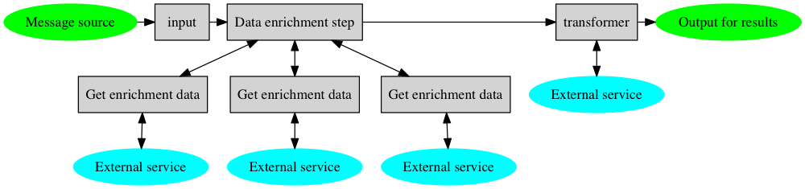

# Reliable Message Driven Services

## Background

This document discusses how to best implement message driven services. Specifically, this covers services that:

* Are driven by messages from RabbitMQ (or another reliable message queue).
* Perform processing on messages, including enriching these with data from web services.
* Pass on the results of processing to other systems, such as a database, a search index, or as new messages sent via the message queue.

What we want is a way to make it as easy as possible to write such services, while ensuring that they are reliable and scalable. Specifically, the requirements are:

* Messages should never be lost. That is, messages should never be acknowledged without having been fully processed.
* It is acceptable to process messages twice, in exceptional circumstances such as broker or network failures.
* It’s **not** necessary to preserve message ordering.
* Services must recover automatically from external failures such as network errors, DB failures, RabbitMQ broker failures and web services not being available.
* If messages are inherently impossible to process, typically because they’re invalid, then these messages must be written to some other storage such as a database or another queue for manual processing.
* Service code should be testable, with unit tests for individual components, and functional tests for the overall flow. In particular, it should be easy to test error scenarios such as outages of external web services and databases.
* There should be a minimum of boilerplate code and configuration in each service implementation. Implementors of services should only have to focus on the business logic of the service.
* Services should make efficient use of multiple cores where possible to make them scalable for large message volumes.

The following section describes various options we’ve trialled for these services, and the imaginary use case we used for trying these out.

## Example use case

To try out various ways of writing message driven services, we came up with an imaginary use case that looks as follows:

* We receive input messages at regular intervals from a source that wants these messages ACKed and NACKed.
* We initially fetch three bits of additional information (of differing type) based on the input message. These requests should happen in parallel.
* We perform a transform step on the resulting data.
* We write the output of the transform step to an output that represents a database or similar.

The following diagram shows the logical steps of this example:

This example should be complex enough to give a realistic impression of how a solution looks.

We created some simple implementations to represent external services, i.e. that provide enrichment data, do transforms and process outputs. [The code for these services](https://git.mobcastdev.com/jans/scala-streams-examples/blob/master/src/main/scala/com/blinkbox/books/streams/Services.scala) was reused across all example implementations. Each of these services were set up to fail randomly at certain frequencies, and to take varying amount of time to produce their results.

## RxJava

### Background

RxJava is an open source library (with Java and Scala bindings) for processing asynchronous events as streams, [published by Netflix](https://github.com/Netflix/RxJava). It featured in the [Coursera course on reactive programming](https://class.coursera.org/reactive-001), in the lectures given by [Erik Meijer](http://en.wikipedia.org/wiki/Erik_Meijer_(computer_scientist])).

It lets you write complex async processing by writing operations on streams (or "Observables"), that look a lot like functional transforms on collections, e.g. using `map`, `filter` and `zip`. It abstracts away all the underlying machinery of synchronisation, message passing etc. hence lets you focus on what you're trying to achieve instead. In a sense, it's quite a declarative way of programming.

## Results

The inital version for this use case looks very neat and simple, and shows with this style of programming is very attractive: the whole pipeline of transforms is less than 15 lines of code! (See [SimpleRxEnrichmentPipeline.scala](src/main/scala/com/blinkbox/books/streams/SimpleRxEnrichmentPipeline.scala)). (Though this example doesn't deal with retrying operations on external sercices, it assumes that's handled in each service operation)

There are however a couple of drawbacks. First of all - it doesn't work! Specifically, it doesn't handle error scenarios as we want. It's an inherent feature of Rx Observables that once an error occurs anywhere in the stream, the whole stream is considered failed. That's not what we want; we want to deal with each error by writing them somewhere then carrying on.

I briefly tried writing a version that instead of raising errors for invalid messages, would pass on values as a Scala `Either[L, R]` type, with the left part of the Either representing a failure and the right part representing a successful value. The result was very ugly though, see [ErrorHandlingRxEnrichmentPipeline.scala](src/main/scala/com/blinkbox/books/streams/ErrorHandlingRxEnrichmentPipeline.scala), as each step in the pipeline now has to explicitly deal with the success vs. failure cases, so the simpleness of the Rx API is lost.

I concluded the RxJava just isn't a good fit for our use case. It's a shame though, as writing stream processing in a functional, declarative is very neat and simple - maybe some other stream library will be a better fit (see below).

## Akka

### Background

[Akka](http://akka.io/) is a library for asynchronous message processing. It's heavily inspired by [Erlang](http://www.erlang.org/), and provides mechanisms for building reliable and scalable systems based on message passing between "actors". It's widely used, and is becoming more and more pervasive in the Scala community. It featured in the Coursera course on reactive programming, in the lectures by [Roland Kuhn](http://rolandkuhn.com/), there's a wide variety of books and articles covering it, and it's [well documented](http://akka.io/docs/).

### Initial results

Akka provides a number of mechanisms for building reliable systems, e.g. supervisor hierarchies. The actor model also means that you never write code using locks, mutexes or explicit threads; it's all done by passing immutable messages around. This means the chance of race conditions and deadlocks is greatly reduced. Still, the mechanisms Akka provide are quite low level, e.g. compared to the streaming APIs of RxJava, so developers still need to know about Akka concepts and how to make correct use of them.

The initial version of our example implemented each step in the pipeline using actors written from scratch, but that resulted in a lot of code - [hundreds of lines before it was even fully complete](https://git.mobcastdev.com/jans/scala-streams-examples/blob/993561952a4c7c52d8a434c517e0f194b7dd424e/src/main/scala/com/blinkbox/books/streams/AkkaEnrichmentPipeline.scala)! Writing actors correctly is also an error prone process, you have to be careful about dealing with errors in the expected way, sending responses to the right place etc. Also, as actors are not type safe it's easy to make mistakes, and it can also be quite tricky to debug things when they go wrong.

### A second iteration

It was obvious from the first cut though, that there was a lot of repeated code between actors, so I tried to factor out the commonality, including error handling, into shared code. This was based on the observation that we have a few common concepts:

* We have a pipeline of actors, where messages are passed downstream, resulting in some side-effects on one or more final values.
* We have something that listens for the overall success or failure of a message's passing through the pipeline, and responds to the input accordingly.
* We have workers that interact with external services that may fail, and that should be retry their task when temporary failures occur with these services.
* Workers send the result of their processing either to the sender of the input (in the case of enrichment-style stages) or to an output (in the case of transform-style stages).

In such pipelines, the code for each new concrete actor class should only have to deal with the specific processing that happens in that actor, as well as classifying any errors that may occur into "temporary failure" vs. "unrecoverable failure".

The result is in [AkkaEnrichmentPipeline.scala](src/main/scala/com/blinkbox/books/streams/AkkaEnrichmentPipeline.scala) with the shared code in [AkkaPipelineActors.scala](src/main/scala/com/blinkbox/books/streams/AkkaPipelineActors.scala). Now the example code is more succinct. It's still much longer than the Rx example, but now we do have the advantage of exact control over the behaviour and error handling at each step. Developers aren't complete shielded from Akka though, they still have to know how to write and debug actors.

Note that the actor code in this section uses a number of patterns such as "Capture Context" and "Cameo", see the ["Effective Akka"](http://my.safaribooksonline.com/book/programming/scala/9781449360061/2dot-patterns-of-actor-usage/ch02_html) book for details on these. Also, ["Developing an Akka Edge"](http://techbus.safaribooksonline.com/9781939902054/h2_43_xhtml?percentage=0&reader=html#X2ludGVybmFsX0h0bWxWaWV3P3htbGlkPTk3ODE5Mzk5MDIwNTQlMkZjaDAwNF9jaGFwdGVyXzVfaGFuZGxpbmdfZmF1bHRzX2FuZF9hY3Rvcl9oaWVyYXJjaHlfeGh0bWwmcXVlcnk9) is a good source of information about error handling patterns in Akka.

## Futures

Another option for writing message driven services is to view them much like the web services we're writing, where instead of having incoming HTTP requests, we have incoming messages.

In our web services, we tend to use `Future`s to implement whatever processing that needs to take place in order to produce a response, including fetching data from other services and writing results to a database. We could write the message driven services in exactly the same way.

The question than becomes how to deal with error scenarios. In a web service we can just return a failure error code. That's not good enough in a message driven service, here we basically want to retry processing until we succeed - or if the input is bad, store the bad message somewhere before moving on.

There are a couple of options for how we could do the retry logic - we could make it part of each `Future` that's executed, e.g. wrap requests to external services in a `retry {}` block. Or, at the input level where we pick up messages and kick off processing in Futures, we could respond to a (temporary) failure by rescheduling the message to be processed later, until it succeeds.

I've put an early cut of an implementation for this variation in [FuturesProcessor.scala](src/main/scala/com/blinkbox/books/streams/FuturesProcessor.scala). Interestingly, the meat of it is < 40 lines of code, took < half an hour to write - and worked first time! That was definitely not the case with the Actor version... so I'm starting to think this is a strong candidate. Maybe we just don't need all the advanced features of Akka in simple, straight-through, stateless messaging services.

Note that this first version doesn't do retries of individual requests yet, I will try to add wrappers around each step that does this. The consequence of not having such retries is that when failure happens, each message will be retried right from the start. That could cause a fairly large number of requests on the services that are working, that get accessed before the failing service.

# Other options

Things we haven’t had time to try (yet):

- Akka Streams (promising, very early, no docs, moving fast, exact features and behaviour unknown). See [Akka Streams](http://typesafe.com/activator/template/akka-stream-scala) and [Reactive Streams](http://www.reactive-streams.org/).
- scalaz-stream: See [home page](https://github.com/scalaz/scalaz-stream). Inspired by the Haskell library [Machines](https://github.com/ekmett/machines/). Details not known.
- future-streams: See [home page](https://github.com/fsist/future-streams). Small project, details not known.

